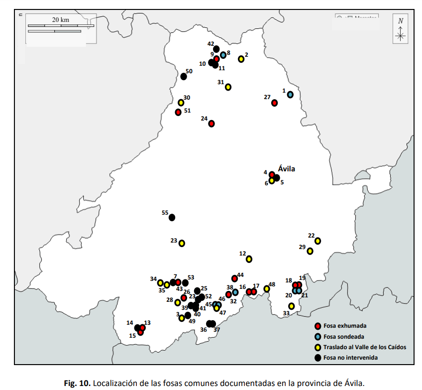
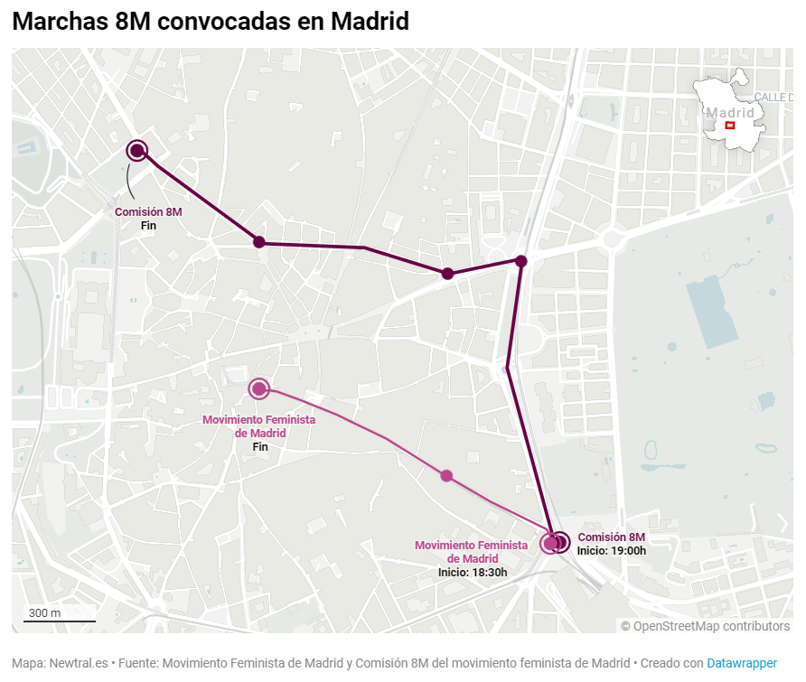
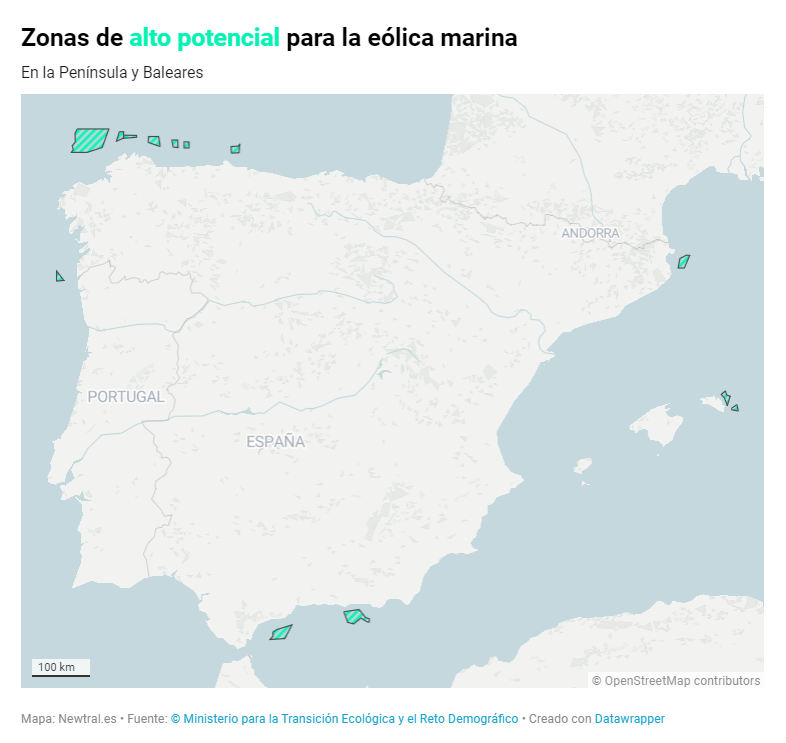
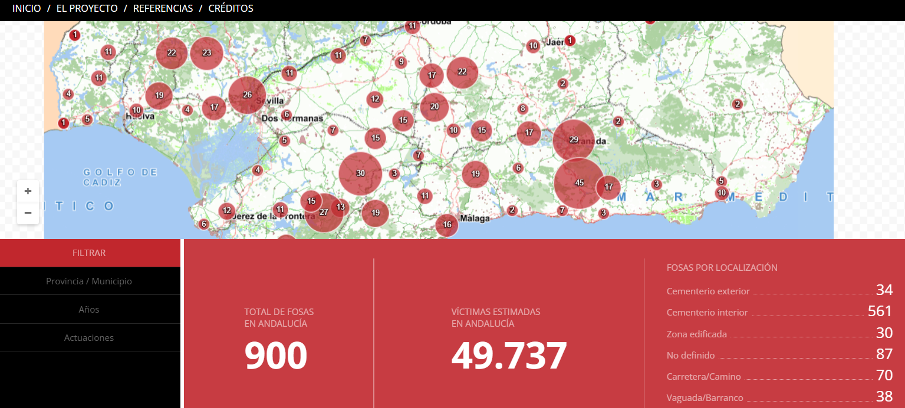
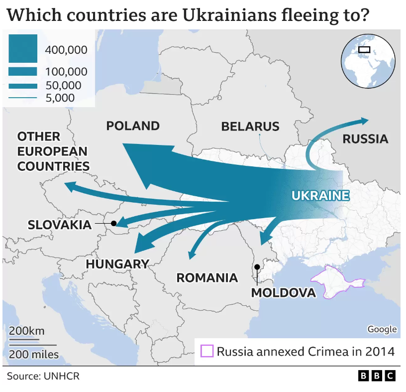
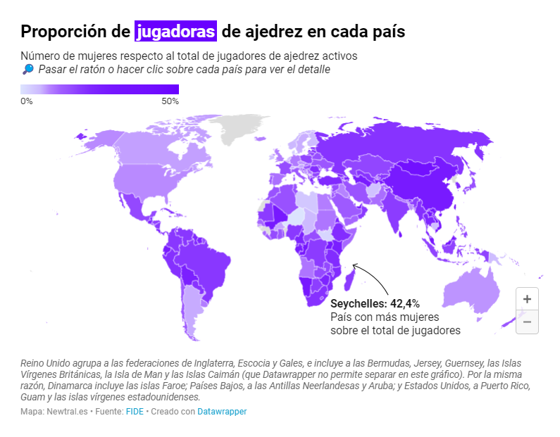

### 07/06/2023

## Ejemplos de tipos de visualizaciones cartográficas

- **Mapas cualitativos**

  - De puntos: mapa de fosas por tipo en Castilla y León [página 39 del PDF](https://www.jcyl.es/web/es/administracionpublica/memoria-historica-democratica/mapa-fosas-castilla-leon.html); también se puede ver en [Navarra](https://fosas.navarra.es/#ZXh0fGJhc2V8bWFwYWJhc2V8bGF5ZXJzXl4zNjc1NjkuMzQyfDQ2MDQ0NjMuNDk0fDg1OTA4OS4zNDJ8NDgzMjk0My40OTReJDB8QDR8NXw2fDddfDF8MnwzfEBdXQ==)
  
  

  - Lineales: recorrido de las manifestaciones del 8-M publicado por [Newtral.es](https://www.newtral.es/manifestaciones-8-m-recorrido-madrid-barcelona/20230307/)
  
  

  - Superficiales: mapa que muestra las zonas de alto potencial para la eólica marina en España publicado por [Newtral.es](https://www.newtral.es/planes-ordenacion-espacio-maritimo-eolica-marina-offshore/20230301/)
  
  

- **Mapas cuantitativos**

  - De puntos: mapa de fosas [en Andalucía](https://www.juntadeandalucia.es/organismos/turismoculturaydeporte/areas/cultura/memoria-democratica/fosas.html)

  

  - Lineales (incluyen isolíneas e isopiezas): movimiento de los refugiados ucranianos según el país de destino publicado por la [BBC](https://www.bbc.com/news/uk-politics-60616262)

  

  - Superficiales (coropletas): mapa sobre la proporción de las jugadoras de ajedrez en cada país publicado por [Newtral.es](https://www.newtral.es/ajedrez-mujeres-deporte-femenino/20230307/)

  
